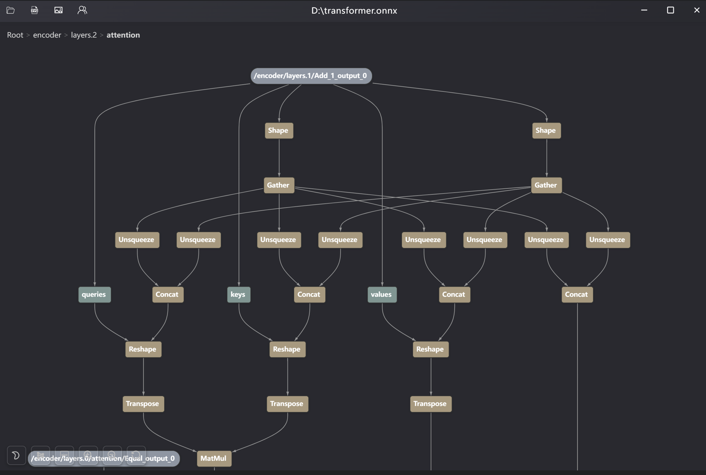

# BlockShow
An intuitive and efficient ONNX model visualization tool, designed to parse neural network structures into nested hierarchical layers—delivering far more lucid structural comprehension than direct flat visualization.

## Install
**Windows**: [**Download**](https://github.com/Florian-Wang/BlockShow/releases/latest) the `.exe` installer
